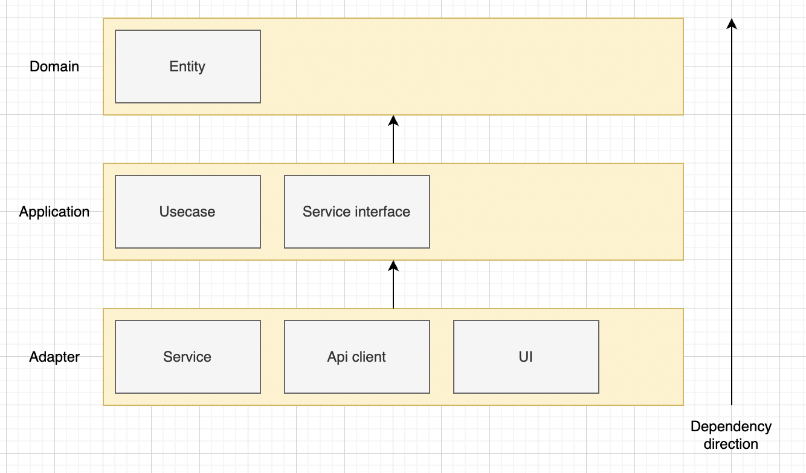
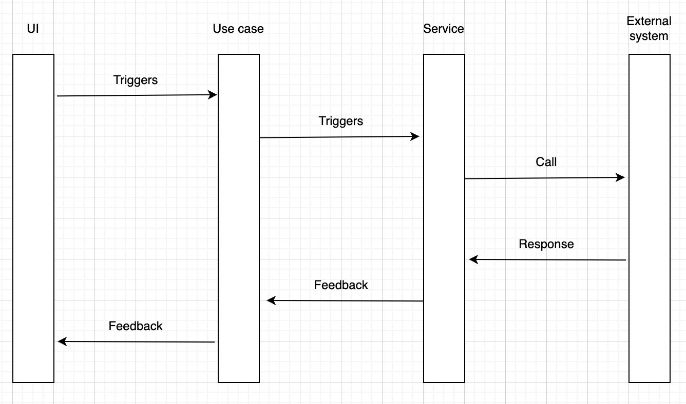

# Clean Arch React

## What is this project?
This is a sample project to implement clean architecture in react to dive deeper into how can we architect react applications. 

Architecting react application is not a piece of case. 
The official team does not tell us much, nor there is silver bullet on web articles. 
Though there cannot be silver bullet for any technology topic, there can be a silver-bullet-ish ideas. 
This project is one of the attempts to find such idea.

Base idea is borrowed from https://dev.to/bespoyasov/clean-architecture-on-frontend-4311 . 
There are tons of articles about writing react in clean architecture, but the implementation detail vary a lot. 
However, this one seemed most suitable for me as its system components were easy enough to understand and implement. 
Most of the code is implemented referring to above article, but some modifications has been made to match this sample app's requirement.

## About the app
This app is a simple clone of asana app (design is inspired too!). 
The features provided are:
- User can login / logout.
- User can create / update / delete project.
- User can create / update / delete task.

## About the implementation
### Overview of the architecture

This diagram is the overview. 
About the layers:
- Domain layer
    - This layer defines entities and transformation logic.
    - With this implementation of clean architecture, it does not contain much, but could be improved?
- Application layer:
    - This layer contains the logics of what should be achieved when certain user action happens.
    - For the part that needs to interact with external system, Service object is used
        - Service object is DI-ed through custom hook.
- Adapter layer:
    - This layer contains anything outside the application layer.
    - Services implementation lives here.
    - UI (react) lives here as well.

### Use case process flow

This diagram illustrates how the process of use case flows. 
The basic idea is that UI triggers use case, then use case utilizes service object to interact with external system. 

### Key factors of thie architecture
#### Existence of React elements in application layer
Normally application layer should be framework agnostic, but in this implementation, use case directly utilizes react custom hook. 
This is for following reasons:
- For the ease of implementation
    - If we were to banish React elements from application layer, the implementation would be overly cumbersome.
    - This is because application layer would have no way to access data inside React realm.
    - By defining use case as react custom hook, we can easily integrate React specific data into our application logic.

#### DI is expressed through react custom hook
The DI mechanism of this implementation is not strictly following how it should be implemented. 
Instead of making it injectable at runtime, the use case implementations kind of directly instantiating service object by calling custom hook. 
According to the original implementation, we are calling this crooked-DI-container. 
We can take custom hooks as a DI-container which returns a certain implementation. 

## What has been found through this project?
### Good points
#### Testability
Obviously this is one of the motivations to adopt this architecture. 
All the additional work implementing use case pays off here. 
Mocking the service objects would be hassle though. 

#### Fine grained system components
While it takes some efforts to grasp the overall architecture, this architecture should provide a well defined system components. 
With system components defined clearly, we should be able to work on the project as a team without diverging how we implement. 

#### Reusability of use case and service object.
Since we are supposed to implement these components with well defined boundaries, they have good reusability as well. 
Same logic can be reused any where.

### Problems
#### Steep learning curve
Yes here it is. Supposedly this is a case to any well-architected program. 
At least clean architecture is a well-known pattern, developers should feel relatively easy to get used to it. 

#### Where to place which custmo hook?
Sometimes it is confusing to decide the place to define custom hook. 
For example, you might get lost between service object or modules/hooks. 
Rule of thumb would be whatever related to application layer logic should go service object.

## Conclusion
It took me some time to build this sample and organize the doc, but I suppose it was a good learning opportunity. 
React does not really have a go-to architecture. 
You can spend hours to search for one on internet, but you will end up with React official team's do whatever you want. 
The more architecture patterns you know, the better you can handle real world use cases. 
Let's do our best to be better architect.

---

# Todo
- [ ] Implement test codes
- [ ] Implement task thread feature
- [ ] document the motivation to adopt this architecture
    - testability? should try to write test as well.
- [x] Implement Tasks page
    - show tasks in list table
    - create task
    - edit task
    - delete task
- [x] Implement Projects page
    - show projects in list table
    - create project
        - basic
        - assign user to project
    - edit project
    - delete project
- [x] Implement login feature
    - Dashboard page 
    - Login feature
    - currentUser mechanism
    - show current user in dashboard
    - load current user from sessionstorage
    - logout
    - redirect to login page if not logged in
- [x] Write document about the pages

# Document
## Pages
### Dashboard page
- Show account info
- Show my tasks

### Login page
- Login with the existing account
    - Just select from existing account

### Projects page
- List out all the existing projects
- Create new project
- Delete project
- Show / update project

### Tasks page
- List out all the existing tasks
- Can filter out
    - assignee
    - project
- Create new task
- Delete task
- Show / update task
    - Can do message thread

## Models
- Project
    - id: number;
    - title: string;
    - description: string;
    - start_date: Date;
    - end_date: Date;
    - created_at: Date;
    - updated_at: Date;
    - assignees: User[];
- Task
    - id: number;
    - project_id: number;
    - title: string;
    - description: string;
    - status: string;
    - created_at: Date;
    - updated_at: Date;
    - assignees: User[];
- User
    - id: number;
    - name: string;
    - created_at: Date;
    - updated_at: Date;
